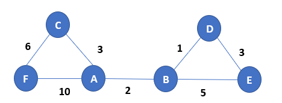

# 弗洛伊德(Floyd)算法
---

- 简介
  - Floyd算法又称为插点法，是一种利用动态规划的思想寻找给定的加权图中多源点之间最短路径的算法，与Dijkstra算法类似。
  - 在计算机科学中，Floyd-Warshall算法是一种在具有正或负边缘权重（但没有负周期）的加权图中找到最短路径的算法。算法的单个执行将找到所有顶点对之间的最短路径的长度（加权）。 虽然它不返回路径本身的细节，但是可以通过对算法的简单修改来重建路径。 该算法的版本也可用于查找关系R的传递闭包，或（与Schulze投票系统相关）在加权图中所有顶点对之间的最宽路径。

## 1. 算法核心思路
---
- 路径矩阵
  
    通过一个图的权值矩阵求出它的每两点间的最短路径矩阵。
    从图的带权邻接矩阵A=[a(i,j)] n×n开始，递归地进行n次更新，即由矩阵D(0)=A，按一个公式，构造出矩阵D(1)；又用同样地公式由D(1)构造出D(2)；……；最后又用同样的公式由D(n-1)构造出矩阵D(n)。矩阵D(n)的i行j列元素便是i号顶点到j号顶点的最短路径长度，称D(n)为图的距离矩阵，同时还可引入一个后继节点矩阵path来记录两点间的最短路径。
    采用松弛技术（松弛操作），对在i和j之间的所有其他点进行一次松弛。所以时间复杂度为O(n^3);
- 状态转移方程

    其状态转移方程如下： map[i,j]:=min{map[i,k]+map[k,j],map[i,j]}；
    map[i,j]表示i到j的最短距离，K是穷举i,j的断点，map[n,n]初值应该为0，或者按照题目意思来做。
    当然，如果这条路没有通的话，还必须特殊处理，比如没有map[i,k]这条路。

## 2. 算法过程
---
1. 从任意一条单边路径开始。所有两点之间的距离是边的权，如果两点之间没有边相连，则权为无穷大。
2. 对于每一对顶点 u 和 v，看看是否存在一个顶点 w 使得从 u 到 w 再到 v 比已知的路径更短。如果是更新它。
把图用邻接矩阵G表示出来，如果从Vi到Vj有路可达，则G[i][j]=d，d表示该路的长度；否则G[i][j]=无穷大。定义一个矩阵D用来记录所插入点的信息，D[i][j]表示从Vi到Vj需要经过的点，初始化D[i][j]=j。把各个顶点插入图中，比较插点后的距离与原来的距离，G[i][j] = min( G[i][j], G[i][k]+G[k][j] )，如果G[i][j]的值变小，则D[i][j]=k。在G中包含有两点之间最短道路的信息，而在D中则包含了最短通路径的信息。
比如，要寻找从V5到V1的路径。根据D(D用于求解两点之间的中间点，也就是是否能够直达)，假如D(5,1)=3则说明从V5到V1经过V3，路径为{V5,V3,V1}，如果D(5,3)=3，说明V5与V3直接相连，如果D(3,1)=1，说明V3与V1直接相连。

## 3. 算法举例
---
上面讲了那么多，其实都不如直接举例来的痛快，现在我们就通过一个实例，来进一步了解什么是弗洛伊德算法。
由于计算量较大，所以这里仅使用一个较小的图来进行举例。如下图：

该图的路径连通矩阵如下所示。行列开始都是按照字母顺序，如 $A[1,2]$ 即为图中 A到B的距离。

  1. 初始化图矩阵

$
A=\left[ \begin{matrix}
 0 & 2 & 3 & \infty & \infty & 10\\
 2 & 0 & \infty & 1 & 5 & \infty\\
 3 & \infty & 0 & \infty & \infty & 6\\
 \infty  & 1 & \infty & 0 & 3 & \infty\\
 \infty  & 5 & \infty & 3 & 0 & \infty\\
 10 & \infty & 6 & \infty & \infty & 0\\
  \end{matrix} \right]$

  1. 由A点寻找经由其他中转点到指定点的最小距离，步骤如下：
      - 由A开始，经由B可到D点，距离为3，小于目前的值($\infty$)，故更新值，同理经由B到E距离为7，更新当前值。所以当前A->B=2,A->C=3,A->D=3,A->E=7,经由B不能到F，故以B为中转点只能到达这一步。
      - 接下来使用C作为中转点，可以到达F，距离为9，小于初始值，故更新。
      - 接下来使用D作为中转点，可以到达E，距离为6，小于由B到达E，故更新。
      - 以此反复，直至到倒数第二个，那么A到个点的最短距离便求解出来了，由于该图是无向图，所以是对称的。
      - 经A点更新之后的矩阵如下：

$
A=\left[ \begin{matrix}
 0 & 2 & 3 & 3 & 6 & 9\\
 2 & 0 & \infty & 1 & 5 & \infty\\
 3 & \infty & 0 & \infty & \infty & 6\\
 3 & 1 & \infty & 0 & 3 & \infty\\
 6 & 5 & \infty & 3 & 0 & \infty\\
 9 & \infty & 6 & \infty & \infty & 0\\
  \end{matrix} \right]$

  2. 由B点开始寻找B到各点的最短距离，和A一样的操作过程。
       - B以A为中转点，到达C距离为5，小于当前值，更新当前值。
       - B以A为中转点，到达F距离为11，小于当前值，更新当前值。
       - B以D为中转点，到达E距离为4，小于当前值，更新当前值。
       - B以E为中转点，到达D距离为8，大于当前值，不更新当前值。
       - 经B点更新之后的矩阵如下：

$
A=\left[ \begin{matrix}
 0 & 2 & 3 & 3 & 6 & 9\\
 2 & 0 & 5 & 1 & 4 & 11\\
 3 & 5 & 0 & \infty & \infty & 6\\
 3 & 1 & \infty & 0 & 3 & \infty\\
 6 & 4 & \infty & 3 & 0 & \infty\\
 9 & 11 & 6 & \infty & \infty & 0\\
  \end{matrix} \right]$

  3. 由C点开始寻找C到其余各点的最短距离，和之前一样的操作过程。
       - C以A为中转点，到达D距离为6，小于当前值，更新当前值。
       - C以A为中转点，到达E距离为9，小于当前值，更新当前值。
       - C以A为中转点，到达F距离为13，大于当前值，不更新当前值。
       - 以此可到达的点作为中转点不断重复，直至遍历完。
       - 经C点更新之后的矩阵如下：

$
A=\left[ \begin{matrix}
 0 & 2 & 3 & 3 & 6 & 9\\
 2 & 0 & 5 & 1 & 4 & 11\\
 3 & 5 & 0 & 6 & 9 & 6\\
 3 & 1 & 6 & 0 & 3 & \infty\\
 6 & 4 & 9 & 3 & 0 & \infty\\
 9 & 11 & 6 & \infty & \infty & 0\\
  \end{matrix} \right]$

  4. 由D点开始寻找D到其余各点的最短距离，和之前一样的操作过程。
       - D以A为中转点，到达F距离为12，小于当前值，更新当前值。
       - 以此可到达的点作为中转点不断重复，直至遍历完。
       - 经D点更新之后的矩阵如下：

$
A=\left[ \begin{matrix}
 0 & 2 & 3 & 3 & 6 & 9\\
 2 & 0 & 5 & 1 & 4 & 11\\
 3 & 5 & 0 & 6 & 9 & 6\\
 3 & 1 & 6 & 0 & 3 & 12\\
 6 & 4 & 9 & 3 & 0 & \infty\\
 9 & 11 & 6 & 12 & \infty & 0\\
  \end{matrix} \right]$

  5. 由E点开始寻找E到其余各点的最短距离，和之前一样的操作过程。
       - E以A为中转点，到达F距离为16，小于当前值，更新当前值。
       - 以此可到达的点作为中转点不断重复，直至遍历完。
       - 经E点更新之后的矩阵如下：

$
A=\left[ \begin{matrix}
 0 & 2 & 3 & 3 & 6 & 9\\
 2 & 0 & 5 & 1 & 4 & 11\\
 3 & 5 & 0 & 6 & 9 & 6\\
 3 & 1 & 6 & 0 & 3 & 12\\
 6 & 4 & 9 & 3 & 0 & 15\\
 9 & 11 & 6 & 12 & 15 & 0\\
  \end{matrix} \right]$

- 最终的结果便为：
$
A=\left[ \begin{matrix}
 0 & 2 & 3 & 3 & 6 & 9\\
 2 & 0 & 5 & 1 & 4 & 11\\
 3 & 5 & 0 & 6 & 9 & 6\\
 3 & 1 & 6 & 0 & 3 & 12\\
 6 & 4 & 9 & 3 & 0 & 15\\
 9 & 11 & 6 & 12 & 15 & 0\\
  \end{matrix} \right]$

## 4. 代码运行示例
---

- 从上面的举例可以看出，图可以直接使用矩阵存储，也即二维数组，将图初始化为一个二维数组，便可。

- 由于无向图形成的矩阵是对称的，因此我们只需要计算上三角矩阵或者下三角矩阵便可。
- 代码请见[弗洛伊德(Floyd)算法](./code/Floyd.cpp)

