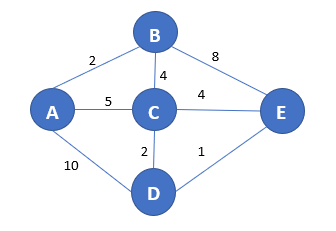

# 迪杰斯特拉算法

## 1. 定义
---
迪杰斯特拉算法是从一个顶点到其余各顶点的最短路径算法，解决的是有权图中最短路径问题。迪杰斯特拉算法主要特点是从起始点开始，采用贪心算法的策略，每次遍历到始点距离最近且未访问过的顶点的邻接节点，直到扩展到终点为止。

## 2. 算法描述
---
迪杰斯特拉算法求解一个顶点到其余各顶点的最短路径求解描述如下：

    step 1:确定起点以及目标顶点，将已确定的顶点放入集合R，在一开始R中只有起点；同时将目标顶点放入集合T。
    step 2:确定起点到其中一个目标顶点的最短距离，并将最短路径以及最短距离存储，并将该顶点放入集合R，同时再集合T中删除该顶点。
    step 3:判断目标顶点集合是否为空，若不为空，则跳转 step 2。
    step 4:输出起点到各目标顶点的最短路径以及相应的最短距离。

## 3. 举例说明
---
以下图无向有权图为例：



  - 规定 A 为起点则已确定集合R={A}，目标定点集合T={B,C,D,E}
    1. 对于顶点B，从图中可以看出来由A直接到B距离最近，所以到达B点的最优路径为  **A->B** ,最短举例为2.此时集合R={A,B}，集合T={C,D,E}。
    2. 对于接下来的顶点C，由起点A止C点的最优路径为：**A->C**，最短距离为5.此时集合R={A,B,C}，集合T={D,E}。
    3. 对于顶点D而言，它可由A，C，E三点到达，而A直接到达D的距离为10，在上一步我们已经求解出A到C的最短距离为5，再加上C到D的距离，总距离为7，要优于A直接到达D；而对于从E到达D点也类似，通过比较我们可以得到由A点到达D点的最优路径为:**A->C->D**，最短距离为：7。此时集合R={A,B,C,D}，集合T={E}。
    4. 继续寻找起点A到E的最优路径，从图中可以看出，可以通过{B,C,D}点到达E点，在之前的结果中就已经得到了A点到达该三点的最优路径以及最短距离，所以此时只需要比较这三点到达E哪个路径最短即可。通过比较能很快确定从路径：**A->C->D->E**到达E点的举例最短，最短距离为：8.此时集合R={A,B,C,D,E},集合T={}.
    5. 集合T已为空，故此时算法结束。


## 4. 程序思维
---
### 4.1 算法思路
---
- 算法设计

  1. 首先，要确定图在程序中是如何存储的。在程序中，图的存储方式是以邻接表的形式存在的。因此需要定义一个定点结构体，以及一个邻接点结构体，在这两个结构体中分别存储对应点以及对应点存在的邻接点。还是以上图为例，在程序中，邻接表如下：
  - **注意：** 在下面的邻接表中，邻接点结构体（x,y）分别表示对应的邻接点以及权重，邻接点对应下标如下：
  {(A,0),(B,1),(C,2),(D,3),(E,4)}
  >[A]->(1,2)->(2,5)->(3,10)

  >[B]->(0,2)->(2,4)->(4,8)

  >[C]->(0,5)->(1,4)->(3,2)->(4,4)

  >[D]->(0,10)->(2,2)->(4,1)

  >[E]->(1,8)->(2,4)->(3,1)
  2. 定义是否获取最短路径标识符数组 **flags**，以该数组来判断指定起点是否已找到相应点的最短路径。
  3. 最短路径长度的存储，在更新最短路径的时候，把每一次遍历的当前起点到对应点的路径更新，更新规则为：如果当前路径长度小于之前已存储的长度，则更新；否则不更新。
  4. 每次选择最短路径数组中路径最短的那个目标点，将其对应的最短路径标识符数组中对应的位置设为“T"，然后以该点辐射其他目标点。
  5. 当数组 **flags** 中的标识值全部为”T“之后，算法结束。输出起点到目标点的对应距离。

- 运行示例
  >我们还是以上面示例为例
  - 初始化**flags**数组为['f','f','f','f','f']
  - 假设起点为**A**，则将**A**目前到达各定点的距离存入**dist**数组;其中，不能到达的定点设为**INT_MAX**，所以此刻**dist**数组为[0,2,5,10,INT_MAX]
  - 将起始点的**flags**设置为**t**.
  - 进入循环，找出当前**flags**为**f**同时到起点最短的点，将该点置为**t**，并以该点查找到其他顶点的距离并更新。循环迭代，N次（N为顶点个数减一）。

  - **迭代运行结果**
    ```
    初始化：

    flags=['t','f','f','f','f']
    dist=[0,2,5,10,INT_MAX]

    第一次：

    flags=['t','t','f','f','f']
    dist=[0,2,5,10,10]

    第二次：

    flags=['t','t','t','f','f']
    dist=[0,2,5,7,9]

    第三次：

    flags=['t','t','t','t','f']
    dist=[0,2,5,7,8]

    第四次：

    flags=['t','t','t','t','t']
    dist=[0,2,5,7,8]
    ```

### 4.2 代码编写
---
代码请见[迪杰斯特拉算法](./code/Dijkstra.cpp)