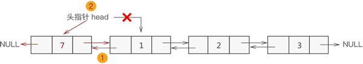
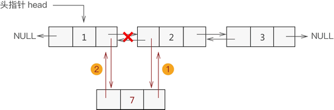
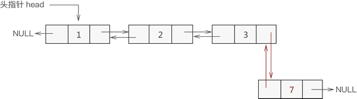
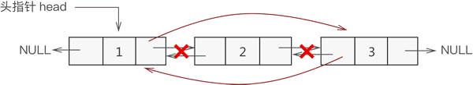

# 双链表（链式存储结构）及创建
---


目前我们所学到的链表，无论是动态链表还是静态链表，表中各节点中都只包含一个指针（游标），且都统一指向直接后继节点，通常称这类链表为单向链表（或单链表）。

虽然使用单链表能 100% 解决逻辑关系为 "一对一" 数据的存储问题，但在解决某些特殊问题时，单链表并不是效率最优的存储结构。比如说，某场景中需要大量地查找某结点的前趋结点，这种情况下使用单链表无疑是灾难性的，因为单链表更适合 "从前往后" 找，"从后往前" 找并不是它的强项。

对于逆向查找（从后往前）相关的问题，使用本文讲解的双向链表，会更加事半功倍。

---
## 双链表的节点
双向链表，简称双链表。从名字上理解双向链表，即链表是 "双向" 的，如下图所示：


>所谓双向，指的是各节点之间的逻辑关系是双向的，但通常头指针只设置一个，除非实际情况需要，可以为最后一个节点再设置一个“头指针”。

根据上图不难看出，双向链表中各节点包含以下 3 部分信息（如下图所示）：
 - 指针域：用于指向当前节点的直接前驱节点；
 - 数据域：用于存储数据元素；
 - 指针域：用于指向当前节点的直接后继节点。

    

根据上述描述，我们可得双链表的节点结构体为（C语言）：
```C
/**
 *  链表节点的结构体
 * 
 *  - ElemType elem 数据域
 *  - struct Link *next 指针域，指向直接后继的节点
 *  - struct Link *prior 指针域，指向直接前驱的节点
 */
typedef struct Link
{
    ElemType elem;
    struct Link *prior;
    struct Link *next;
} link;
```

---
## 双向链表的创建

同单链表相比，双链表仅是各节点多了一个用于指向直接前驱的指针域。因此，我们可以在单链表的基础轻松实现对双链表的创建。

和创建单链表不同的是，创建双向链表的过程中，每一个新节点都要和前驱节点之间建立两次链接，分别是：
- 将新节点的 prior 指针指向直接前驱节点；
- 将直接前驱节点的 next 指针指向新节点；

首先我们应该创建双向链表的节点， C 语言实现代码如下：
```C
/**
 *  初始化链表节点
 *  - link *    返回创建的节点的地址
 *  - ElemType elem 传入该节点所需要存放的值
 */
link *initLinkNode(ElemType elem)
{
    link *node = (link *)malloc(sizeof(link));
    node->elem = elem;
    node->next = NULL;
    node->prior = NULL;
    return node;
}
```

接着，我们就可以开始进行双链表的初始化，由于初始化的时候可能不止一个数据，而且一个数据的我们可以通过创建一个头节点，然后直接使用插入函数进行插入即可。

所以这里我们考虑初始化双链表一堆数据给双链表的的情况，所以我们编写了一个创建部分链表的函数，它接受两个参数，一个是初始数据，使用数组存放，另一个就是数据的数量，具体C语言代码如下：

```C
/**
 * 初始化链表函数：可以直接初始化一堆数据
 * 
 *  - ElemType data[]  初始化数据所存储的数组
 *  - int length    数据量
 */
link *initLink(ElemType data[], int length)
{
    link *start, *end;
    start = initLinkNode(0); // 创建带有空头结点的双链表
    end = start;
    for (int i = 0; i < length; i++)
    {
        link *node = initLinkNode(data[i]);
        end->next = node;
        node->prior = end;
        end = node;
    }
    return start;
}
```

然后我们便可以在主函数内使用该函数，创建一个双链表，并进行输出，为了方便调用输出，我们编写一个输出函数，代码如下：

```C
/**
 *  输出函数：输出链表内的值
 * 
 *  - link *L  传入链表头节点
 */
void displayLink(link *L)
{
    link *temp = L;
    temp = L->next;
    while (temp)
    {
        printf("%d  ", temp->elem);
        temp = temp->next;
    }
    printf("\n");
}
```

主函数运行代码如下：

```C
int main()
{
    link *head;
    int data[] = {11, 22, 33, 44, 55, 66, 77};
    int length = 7;
    head = initLink(data, length);
    displayLink(head);
    system("pause");
    return 0;
}
```
>运行结果为：
>11  22  33  44  55  66  77


如果你仔细看 $initLink$函数 的代码，你就会发现，我们在 $main$ 函数中创建的链表是带头结点的，以上我们就完成了双链表的初始化工作。

---
## 双向链表添加节点

通过我们上面的讲诉，我们可以了解到，我们创建的双链表如下所示：


所以根据数据添加到双向链表中的位置不同，可细分为以下 3 种情况：
>### 1. 添加至表头
>>将新数据元素添加到表头，只需要将该元素与表头元素建立双层逻辑关系即可。
>>换句话说，假设新元素节点为 temp，表头节点为 head，则需要做以下 2 步操作即可：
>> 1. temp->next=head; head->prior=temp;
>> 2. 将 head 移至 temp，重新指向新的表头；

例如，将新元素 7 添加至双链表的表头，则实现过程如下图所示：


>### 2. 添加至表的中间位置
>>同单链表添加数据类似，双向链表中间位置添加数据需要经过以下 2 个步骤，如图下图所示：
>> 1. 新节点先与其直接后继节点建立双层逻辑关系；
>> 2. 新节点的直接前驱节点与之建立双层逻辑关系；


>### 3. 添加至表尾
>>与添加到表头是一个道理，实现过程如下（如下图所示）：
>> 1. 找到双链表中最后一个节点；
>> 2. 让新节点与最后一个节点进行双层逻辑关系；


通过以上分析，我们可以编写插入代码如下：
```C
/**
 *  插入函数
 *  - link *L   要插入的链表
 *  - ElemType elem 要插入的元素
 *  - int site  要插入的位置
 *  注意：链表带有一个空的头指针
 */
void insertLink(link *head, ElemType elem, int site)
{
    link *temp;
    temp = head;
    for (int i = 0; i < site - 1; i++)
    {
        if (temp == NULL)
        {
            printf("插入位置错误，请重新插入！\n");
            return;
        }
        temp = temp->next;
    }
    link *node = initLinkNode(elem);
    if (temp->next == NULL)
    {
        temp->next = node;
        node->prior = temp;
    }
    else
    {
        node->next = temp->next;
        temp->next->prior = node;
        node->prior = temp;
        temp->next = node;
    }
}
```

在上面，我们是通过一个一个对双链表进行添加的，但是往往我们要一次性添加一组数据，所以，在这个需求下，我再编写了一个接收数组插入的插入函数，其基本原理和单个插入其实基本一样，具体代码如下：

```C
/**
 *  插入函数:这个函数是为了方便一下插入大量数据，所以可以接受数组插入
 *  - link *L   要插入的链表
 *  - ElemType data[] 要插入元素组成的数组
 *  - int length    数组的长度
 *  - int site  要插入的位置
 *  注意：链表带有一个空的头指针
 */
void insertArrayToLink(link *head, ElemType data[], int length, int site)
{
    link *temp;
    temp = head;
    for (int i = 0; i < site - 1; i++)
    {
        if (temp == NULL)
        {
            printf("插入位置错误，请重新插入！\n");
            return;
        }
        temp = temp->next;
    }
    if (temp->next == NULL)
    {
        for (int i = 0; i < length; i++)
        {
            link *node = initLinkNode(data[i]);
            temp->next = node;
            node->prior = temp;
            temp = node;
        }
    }
    else
    {
        for (int i = 0; i < length; i++)
        {
            link *node = initLinkNode(data[i]);
            node->next = temp->next;
            temp->next->prior = node;
            node->prior = temp;
            temp->next = node;
            temp = node;
        }
    }
}
```

---
## 双向链表删除节点

在完成插入之后，就开始完成对双链表的删除。

双链表删除结点时，只需遍历链表找到要删除的结点，然后将该节点从表中摘除即可。

例如，从 {${1,2,3}$} 基础上删除元素 2 的操作过程如下图所示：



双向链表删除节点的 C 语言实现代码如下：

```C
/**
 *  删除函数
 *  - link *L   要操作的链表
 *  - int site  要删除的位置
 *  注意：链表带有一个空的头指针
 */
void deleteLink(link *head, int site)
{
    link *temp, *del;
    temp = head;
    for (int i = 0; i < site - 1; i++)
    {
        if (temp == NULL)
        {
            printf("删除位置错误，请重新输入！\n");
            return;
        }
        temp = temp->next;
    }
    del = temp->next;
    if (del->next == NULL)
    {
        temp->next = temp->next->next;
    }
    else
    {
        temp->next = temp->next->next;
        temp->next->prior = temp;
    }
    free(del);
}
```
---
> ### 对于双链表中的其他的操作，比如查询，修改等操作，其实质和单链表无本质区别，这里就不再进行赘述。
---
> 对于双链表的源代码在本级的code文件中，请有需要者自取！！