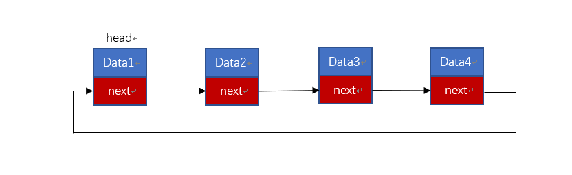
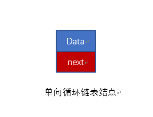

# 循环链表
---
对于单链表以及双向链表，其就像一个小巷，无论怎么样最终都能从一端走到另一端，然而循环链表则像一个有传送门的小巷，因为循环链表当你以为你走到结尾的时候，其实你又回到了开头。

循环链表和非循环链表其实创建的过程以及思路几乎完全一样，唯一不同的是，非循环链表的尾结点指向空（NULL），而循环链表的尾指针指向的是链表的开头。通过将单链表的尾结点指向头结点的链表称之为循环单链表（Circular linkedlist），同理，通过将双链表的尾结点指向头结点的链表称之为循环双链表（Circular linkedlist）。

> 由于双循环链表和单循环链表思路基本一致，这里我们就不去详细对两种链表都进行一步一步解释，而是以单循环链表为例。但是在 $code$ 中，我任然会将单循环链表以及双循环链表的完整代码放置其中，请有需要者自行提取。


---
## 循环链表结点设计（以单循环链表为例）

怎样的链表设计被称为循环链表呢？如下图所示:


像上图所示，便是我们所讲的循环链表。

其实通过上图你会发现对于单循环链表来说，单个节点的结构似乎和单链表并无区别（如下图），甚至，整个结构和单链表也极其相似，其不同之处，仅仅在尾部，和起始头部进行链接，形成了一个环。


所以我们定义一个单循环链表的节点代码与单链表并无差异，具体C语言代码如下：

```C
/**
 *  链表节点的结构体
 * 
 *  - ElemType elem 数据域
 *  - struct Link *next 指针域，指向直接后继的节点
 */
typedef struct Link
{
    ElemType elem;
    struct Link *next;
} link;
```


## 循环单链表初始化

如同单链表的创建，我们需要先创建一个头结点并且给其开辟内存空间，但与单链表不同的是，我们需要在开辟内存空间成功之后将头结点的next指向head自身，我们可以创建一个init函数来完成这件事情，为了以后的重复创建和插入，我们可以考虑在init重创建的结点next指向空，而在主函数调用创建之后手动讲head头结点的next指针指向自身。

这样的操作方式可以方便过后的创建单链表，直接利用多次调用的插入函数即可完成整体创建。

其代码可以表示为：
```C
/**
 * 初始化链表函数：可以直接初始化一堆数据
 * 
 *  - ElemType data[]  初始化数据所存储的数组
 *  - int length    数据量
 */
link *initSingleCircularLink(ElemType data[], int length)
{
    link *start, *end;
    start = initLinkNode(0); // 初始化单链表并携带头节点
    end = start;
    for (int i = 0; i < length; i++)
    {
        link *node = initLinkNode(data[i]);
        end->next = node;
        end = node;
    }
    end->next = start;
    return start;
}
```
> 在上面代码中，初始化过程中是带有头节点的。

## 循环链表的其他基本操作

当你能认真看我之前写的单链表以及双链表的文章，并且能准确理解上面对于循环链表的描述，我想，对于你来说循环链表的其他基本操作基本就不用赘述了。

基本原理都是类似的，只不过不在进行其他操作时不能再通过使用尾节点为空来判断结束了，而是应该通过头节点去判断，看是否与头节点相遇，例如当在插入时，代码应该如下所示：

```C
/**
 *  插入函数
 *  - link *L   要插入的链表
 *  - ElemType elem 要插入的元素
 *  - int site  要插入的位置
 *  注意：链表带有一个空的头指针
 */
void insertSingleCircularLink(link *head, ElemType elem, int site)
{
    link *temp;
    temp = head;
    for (int i = 0; i < site - 1; i++)
    {

        temp = temp->next;
        if (temp == head)
        {
            printf("插入位置错误，请重新插入！\n");
            return;
        }
    }
    link *node = initLinkNode(elem);
    node->next = temp->next;
    temp->next = node;
}

```
> 粗略一看，你会发现，其实这段插入代码与单链表没有很大差别，细看的话仅有一个地方发生改变，那就是判断结束，不再是使用 $temp == NULL$,而是判断它是否回到起始节点 $temp == head$。

> 在这里，留下供大家思考的一个问题，进行插入之初 $temp$ 是指向头节点，那为何我们在使用 $temp == head$ 时不会出现问题。


对于链表阶段，已经讲的很多，其实它们的基本结构大同小异，代码也是基本差不多，只要了解了它们的异同便可，所以就不再编写循坏链表的删除，修改等操作的代码。

> 当然，如果大家有需要，后续再加上吧！那么链表就到此结束，下面，开启新的一个部分，栈！！！