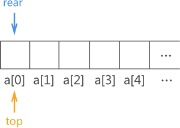
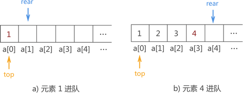

# 队列

队列，和栈一样，也是一种对数据的"存"和"取"有严格要求的线性存储结构。

与栈结构不同的是，队列的两端都"开口"，要求数据只能从一端进，从另一端出，如下图所示：


>通常，称进数据的一端为 "队尾"，出数据的一端为 "队头"，数据元素进队列的过程称为 "入队"，出队列的过程称为 "出队"。

不仅如此，队列中数据的进出要遵循 "先进先出" 的原则，即最先进队列的数据元素，同样要最先出队列。拿上图中的队列来说，从数据在队列中的存储状态可以分析出，元素 1 最先进队，其次是元素 2，最后是元素 3。此时如果将元素 3 出队，根据队列 "先进先出" 的特点，元素 1 要先出队列，元素 2 再出队列，最后才轮到元素 3 出队列。

>栈和队列不要混淆，栈结构是一端封口，特点是"先进后出"；而队列的两端全是开口，特点是"先进先出"。

因此，数据从表的一端进，从另一端出，且遵循 "先进先出" 原则的线性存储结构就是队列。

---
## 队列的分类

队列存储结构的实现有以下两种方式：
1. 顺序队列：在顺序表的基础上实现的队列结构；
2. 链队列：在链表的基础上实现的队列结构；

>两者的区别仅是顺序表和链表的区别，即在实际的物理空间中，数据集中存储的队列是顺序队列，分散存储的队列是链队列。

---
## 队列的实际应用
实际生活中，队列的应用随处可见，比如排队买东西、医院的挂号系统等，采用的都是队列的结构。

拿排队买票来说，所有的人排成一队，先到者排的就靠前，后到者只能从队尾排队等待，队中的每个人都必须等到自己前面的所有人全部买票成功并从队头出队后，才轮到自己买票。这就是典型的队列结构。

---
## 顺序队列的实现

由于顺序队列的底层使用的是数组，因此需预先申请一块足够大的内存空间初始化顺序队列。除此之外，为了满足顺序队列中数据从队尾进，队头出且先进先出的要求，我们还需要定义两个指针（top 和 rear）分别用于指向顺序队列中的队头元素和队尾元素，如下图所示：



由于顺序队列初始状态没有存储任何元素，因此 top 指针和 rear 指针重合，且由于顺序队列底层实现靠的是数组，因此 top 和 rear 实际上是两个变量，它的值分别是队头元素和队尾元素所在数组位置的下标。

在上图的基础上，当有数据元素进队列时，对应的实现操作是将其存储在指针 rear 指向的数组位置，然后 rear+1；当需要队头元素出队时，仅需做 top+1 操作。

例如，在上图基础上将 {1,2,3,4} 用顺序队列存储的实现操作如下图所示：



在上面图基础上，顺序队列中数据出队列的实现过程如下图所示：


下面，我们使用C语言实现顺序队列，首先我们应该定义一个顺序队列结构体，代码如下：
```C
/**
 * 顺序队列结构体
 * ElemType data[MAXSIZE] 数据存储数组，大小为MAXSIZE
 * int top 队头索引
 * int rear 队尾索引
 * int flag 判断队列是否已满的标识符
 */
typedef struct ListQueue
{
    ElemType data[MAXSIZE];
    int top;
    int rear;
    int flag;
} Queue, *listQueue;
```
接下来就是顺序队列的初始化，我们需要在初始化的时候，我们要对队头队尾索引以及判断标识符初始化：
```C
/**
 * 初始化顺序队列
 * Queue 函数返回值
 */ 
Queue initListQueue()
{
    Queue queue;
    queue.top = 0;
    queue.rear = 0;
    queue.flag = 0;
    return queue;
}
```

然后就是出队以及入队函数，在出队以及入队的时候我们都需要判断队列状态，是否上溢或者下溢，然后考虑如何更新队列的对头索引以及队尾索引。

了解了上述要点之后，我们就可以开始编写出队和入队函数，C语言实现如下：

```C
/**
 * 入队操作  无返回值
 * listQueue queue 传入要操作的队列
 * ElemType elem 要传入的元素
 */
void pushListQueue(listQueue queue, ElemType elem)
{
    if (queue->flag)
    {
        printf("队列已满，无法插入！！！\n");
        return;
    }
    if ((queue->rear + 1) % MAXSIZE == queue->top)
    {
        queue->flag = 1;
    }
    printf("push: %d\n", elem);
    queue->data[queue->rear] = elem;
    queue->rear = (++queue->rear) % MAXSIZE;
}
```

在这里实现的是循环的顺序队列，所以在入队时更新队尾索引需要对最大容量取模。同时在队满的情况下我们会输出提示并退出函数。

出队函数如下：

```C
/**
 * 出队操作  函数返回出对元素
 * listQueue queue 要操作的队列
 */
ElemType popListQueue(listQueue queue)
{
    if (!queue->flag && queue->top == queue->rear)
    {
        printf("栈为空，无法执行弹出操作！！\n");
        return -1;
    }
    if (queue->flag)
    {
        queue->flag = 0;
    }
    ElemType res = queue->data[queue->top];
    queue->top = (++queue->top) % MAXSIZE;
    return res;
}
```

在出队时，我们需要对标识符进行操作，当队满之后进行出队操作，我们需要将标识符置为0，也就是队列变为不满的状态。

最后实现的时返回队列现有元素的函数，C语言如下：

```C
/**
 * 计算队列元素个数函数 返回函数个数
 * listQueue queue
 */
int listQueueSize(Queue queue)
{
    if (queue.flag)
    {
        return MAXSIZE;
    }
    return (queue.rear - queue.top + MAXSIZE) % MAXSIZE;
}
```

在编写该函数时我们需要注意，当队满或者队空的时候，通过return 语句计算的队列元素个数都是0，所以在队满的时候我们使用标识符来判断，如果队满，则返回 MAXSIZE。

这样循环的顺序队列就编写完成了。具体代码在code中，需要者自取。下面我们再进行链队列的编写。

---
## 链队列

在一开始我们就分别介绍了顺序队列与链队列的差异，链队列由于是在插入时会申请一个节点空间，所以不存在上溢，也就是空间不足的问题，但是和顺序队列一样，它们都会出现下溢。

首先，我们要创建节点来存储入队的元素，该节点结构体的C语言定义如下：

```C
/**
 * 队列节点
 * ElemType elem 节点存储的元素
 * struct QueueNode *next 下一节点
 */
typedef struct QueueNode
{
    ElemType elem;
    struct QueueNode *next;
} Node, *linkQueue;
```

接下来就是编写初始化节点的函数：
```C
/**
 * 初始化节点函数 返回值为 linkQueue
 * ElemType elem 存储的元素
 */
linkQueue initQueueNode(ElemType elem)
{
    linkQueue node = (linkQueue)malloc(sizeof(Node));
    node->elem = elem;
    node->next = NULL;
    return node;
}
```

在这里面，我们创建的队列是带头结点的，所以我们编写的入队函数如下：
```C
/**
 * 入队函数 无返回值
 * linkQueue queue  入对的队列
 * ElemType elem  入队的元素
 */
void pushLinkQueue(linkQueue queue, ElemType elem)
{
    linkQueue node = initQueueNode(elem);
    linkQueue temp = queue;
    while (temp->next)
    {
        temp = temp->next;
    }
    temp->next = node;
    printf("入队：%d\n", elem);
}
```

出队函数的C语言代码如下：

```C
/**
 * 出队函数 返回值为存储的元素类型
 * linkQueue queue 执行出队操作的队列
 */
ElemType popLinkQueue(linkQueue queue)
{
    if (!queue->next)
    {
        printf("队列已空，无法出队！！\n");
        return -1;
    }
    linkQueue node = queue->next;

    ElemType res = node->elem;
    queue->next = node->next;
    free(node);
    return res;
}
```
在编写出队函数的时候，我们要注意将已出队的元素节点释放，同时注意如何判断队列是否为空。

接下来就是如何去查询队列中含有多少元素。函数如下：

```C
/**
 * 队列元素数量函数 返回队列存储元素的个数
 * linkQueue queue 查询的队列
 */
int linkQueueSize(linkQueue queue)
{
    int size = 0;
    linkQueue temp = queue->next;
    while (temp)
    {
        size++;
        temp = temp->next;
    }
    return size;
}
```

> 顺序队列和链队列全部编写完毕，完成代码都在对应的code文件夹下，请需要者自取。
